# TRABAJO CONFIGURACIÓN DE RED
# Primero hacemos las clonaciones cambiando la MAC:

-A

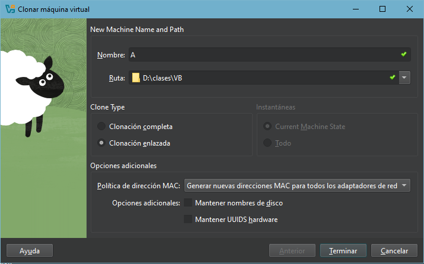

-B

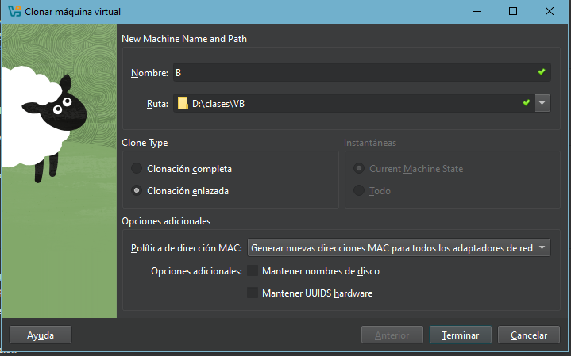

# Después activamos una red más siendo interna llamada "intnet"

-A

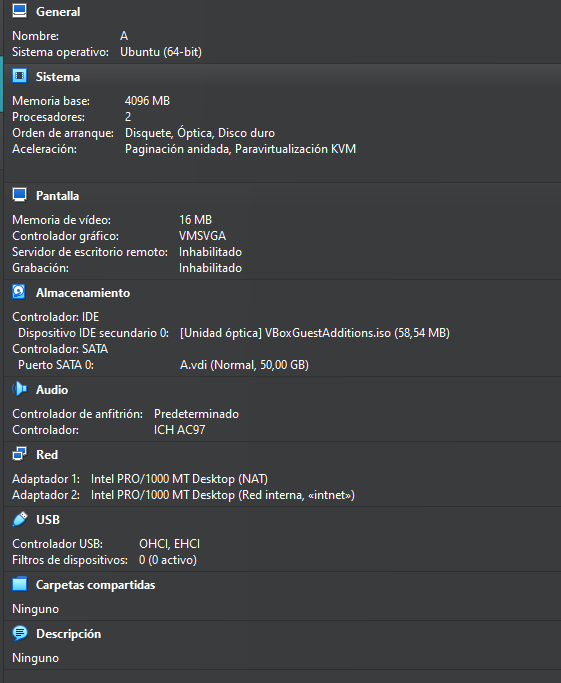

-B

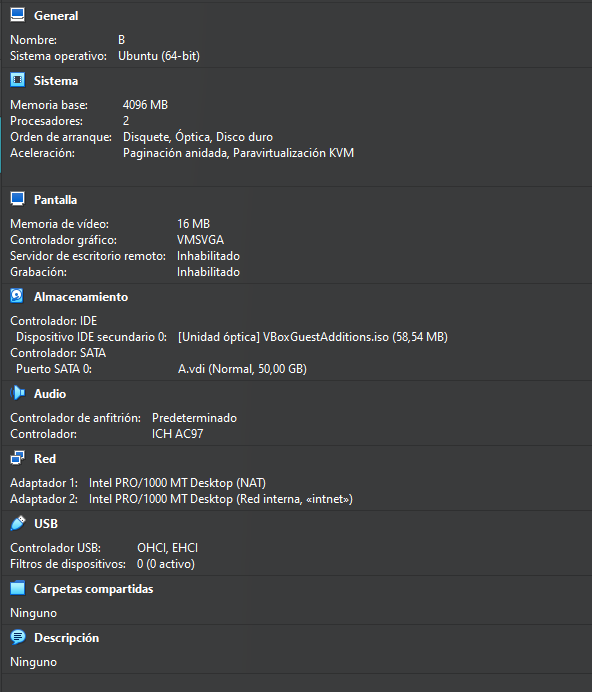

# Después empezamos a ponerles la ip a mano

-A

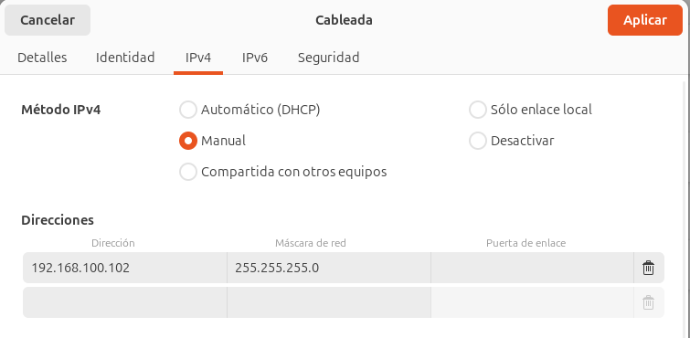

-B

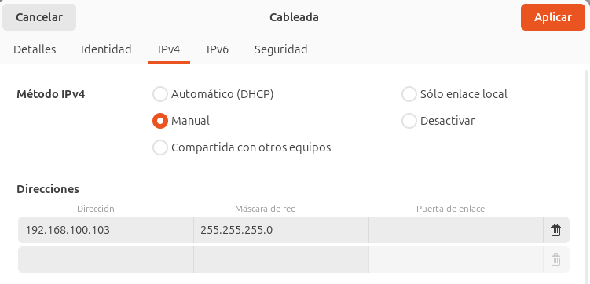

# Después hacemos ping entre ellas para ver que funciona y está bien puestas las ips

-A

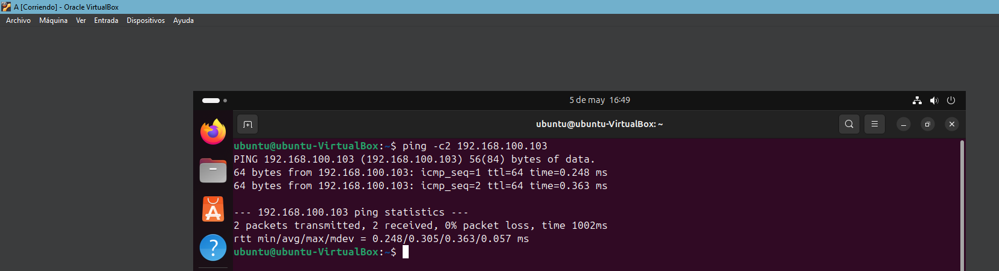

-B

# Actualizamos los paquetes del equipo A

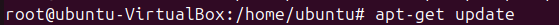

# Instalamos ifupdown

# Editamos el archivo de configuración netplan

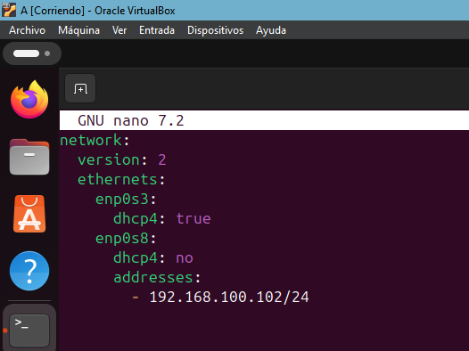

# Probamos que funcione

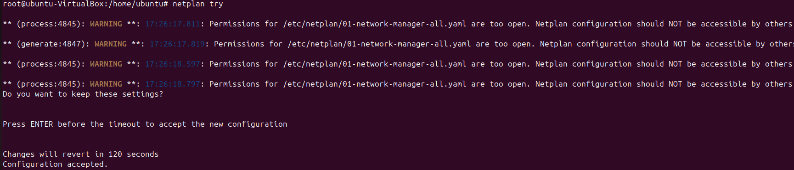

# Lo aplicamos

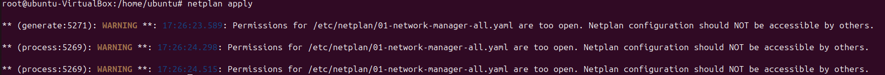

# Y por útimo comprobamos que se ha realizado

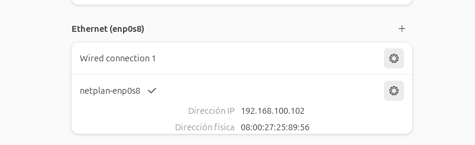

# El B se hace en entorno gráfico

