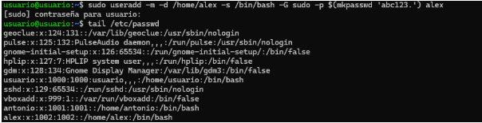

Primero ponemos los ajustes de las dos máquinas:

A
![]
B
![]
Creamos el usuario alex en la máquina A:

creamos el usuario brais en la máquina B:

Nos conectamos a la máquina B desde la máquina A:

Creamos la carpeta prueba en la máquina B

Creamos la carpeta prueba2 en la máquina A

Creamos la carpeta prueba3 con 200 archivos y lo enviamos al escritorio de mi pc:

Y por último comprobamos que está la carpeta creada:
