# TRABAJO SSH/SCP

# Primero ponemos los ajustes de las dos máquinas:

- A

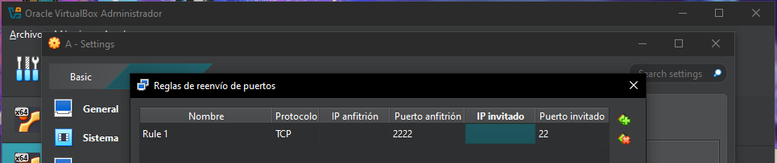

- B

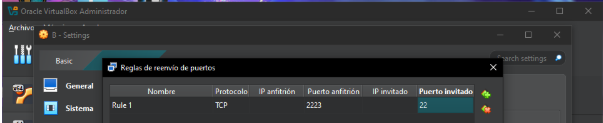

# Creamos el usuario alex en la máquina A:

# Creamos el usuario brais en la máquina B:

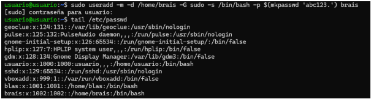

# Nos conectamos a la máquina B desde la máquina A:

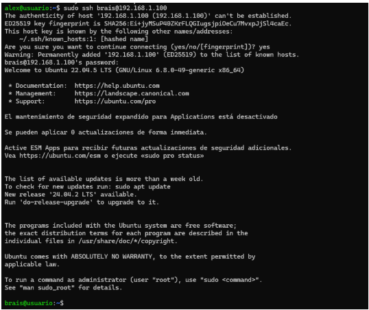

# Creamos la carpeta prueba en la máquina B

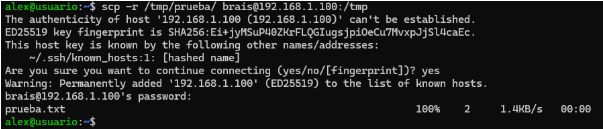

# Creamos la carpeta prueba2 en la máquina A

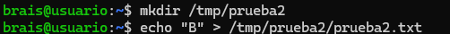

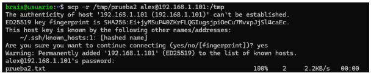

# Movemos las carpetas creadas anteriormente:

- Prueba

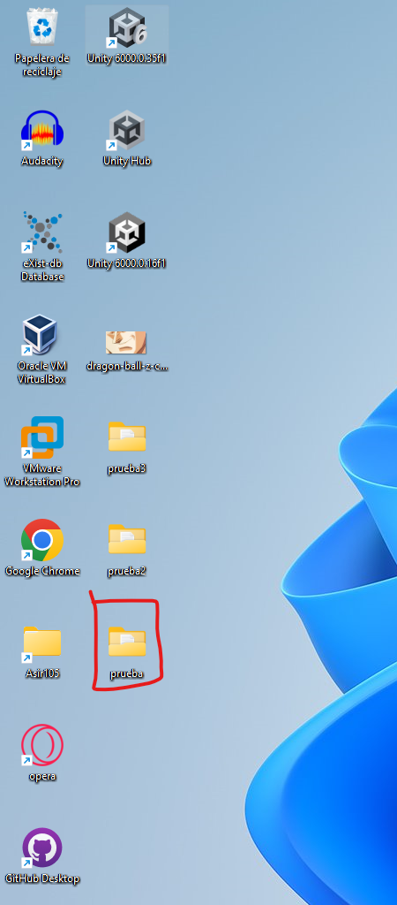

- Prueba2

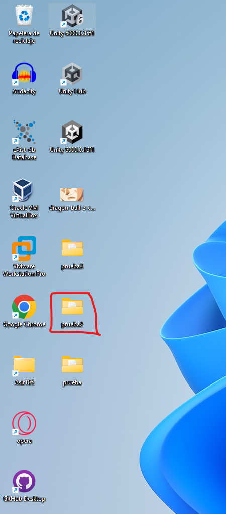

# Creamos la carpeta prueba3 con 200 archivos y lo enviamos al escritorio de mi pc:

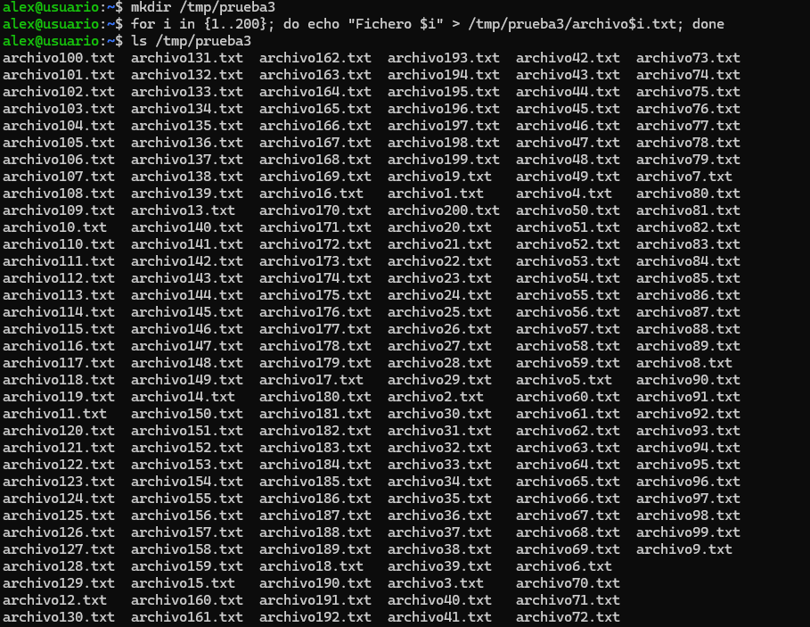

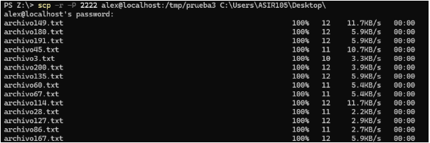

# Por último comprobamos que está la carpeta creada:

